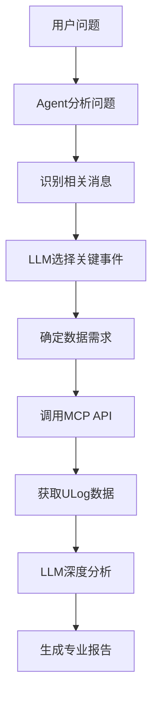

# 🤖 MCP原理 - Agent智能数据选择机制

## 📋 概述

您的Agent系统使用了**MCP (Model Context Protocol)** 架构，让AI能够智能地根据ULog消息自动选择和获取相关的遥测数据。这是一个**自主数据发现和分析**的系统。

## 🧠 核心工作原理

### 1. **消息驱动的数据发现**

```python
# Agent读取ULog中的logged_messages
messages = [
    {"timestamp_us": 123456, "level": "ERROR", "message": "GPS signal lost"},
    {"timestamp_us": 234567, "level": "WARNING", "message": "Battery voltage low"},
    {"timestamp_us": 345678, "level": "INFO", "message": "Mission item reached"}
]

# 基于消息内容智能推断需要的数据
if "GPS" in message:
    recommended_topics = ['vehicle_gps_position', 'estimator_status', 'vehicle_local_position']
elif "BATTERY" in message:
    recommended_topics = ['battery_status', 'vehicle_status', 'commander_state']
elif "NOT ARMING" in message:
    recommended_topics = ['vehicle_status', 'safety', 'sensor_combined', 'estimator_status']
```

### 2. **智能事件检测与分类**

```python
# 事件模式匹配系统
EVENT_PATTERNS = {
    'GPS_ISSUE': {
        'pattern': r'gps|satellite|position.*lost|navigation.*fail',
        'default_topics': ['vehicle_gps_position', 'estimator_status'],
        'time_window_s': 15.0
    },
    'BATTERY_WARNING': {
        'pattern': r'battery|voltage|power.*low|current.*high',
        'default_topics': ['battery_status', 'vehicle_status'],
        'time_window_s': 10.0
    },
    'ARMING_FAILURE': {
        'pattern': r'not.*arm|arm.*fail|safety.*check',
        'default_topics': ['vehicle_status', 'commander_state', 'safety'],
        'time_window_s': 10.0
    }
}
```

### 3. **时间窗口上下文获取**

```python
# 基于事件时间戳获取前后数据
def context_for_event(event_timestamp_us, before_s=5.0, after_s=5.0):
    start_us = event_timestamp_us - (before_s * 1_000_000)
    end_us = event_timestamp_us + (after_s * 1_000_000)
    
    # 获取相关话题在时间窗口内的数据
    context_data = {}
    for topic in recommended_topics:
        if topic in available_topics:
            context_data[topic] = query_topic(topic, start_us, end_us)
    
    return context_data
```

## 🔍 Agent如何知道ULog中有什么数据

### 1. **话题发现机制**

```python
class ULogAccessor:
    def __init__(self, path: str):
        self.ulog = ULog(path)
        # 构建话题映射表 - 这是关键！
        self.topic_map = {d.name: d for d in self.ulog.data_list}
    
    def list_topics(self) -> List[str]:
        """获取ULog中所有可用的话题"""
        return [data.name for data in self.ulog.data_list]
    
    def get_topic_info(self, topic: str) -> Dict[str, Any]:
        """获取话题的详细信息"""
        if topic in self.topic_map:
            data = self.topic_map[topic]
            return {
                'name': topic,
                'fields': list(data.data.keys()),
                'message_count': len(data.data.get('timestamp', [])),
                'field_types': {k: type(v[0]).__name__ if v else 'unknown' 
                               for k, v in data.data.items()}
            }
        return {}
```

### 2. **动态数据结构发现**

```python
# Agent启动时扫描ULog结构
def discover_ulog_structure(ulog_path: str) -> Dict[str, Any]:
    accessor = ULogAccessor(ulog_path)
    
    structure = {
        'available_topics': accessor.list_topics(),
        'message_count': len(accessor.list_messages()),
        'duration_s': (accessor.ulog.last_timestamp - accessor.ulog.start_timestamp) / 1e6,
        'topic_details': {}
    }
    
    # 为每个话题获取字段信息
    for topic in structure['available_topics']:
        structure['topic_details'][topic] = accessor.get_topic_info(topic)
    
    return structure
```

## 🎯 智能数据选择策略

### 1. **基于消息内容的启发式规则**

```python
def analyze_message_content(self, message: str) -> Dict[str, Any]:
    """Agent如何从消息推断需要的数据"""
    
    message_upper = message.upper()
    
    # 关键词匹配 → 相关话题映射
    if any(keyword in message_upper for keyword in ['GPS', 'SATELLITE', 'POSITION']):
        return {
            'event_type': 'GPS_ISSUE',
            'recommended_topics': [
                'vehicle_gps_position',      # GPS原始数据
                'estimator_status',          # 估计器状态
                'vehicle_local_position'     # 本地位置
            ],
            'time_window_s': 15.0           # GPS问题需要更长观察窗口
        }
    
    elif any(keyword in message_upper for keyword in ['BATTERY', 'VOLTAGE', 'POWER']):
        return {
            'event_type': 'BATTERY_WARNING',
            'recommended_topics': [
                'battery_status',            # 电池状态
                'vehicle_status',            # 飞行器状态
                'commander_state'            # 指挥器状态
            ],
            'time_window_s': 10.0
        }
```

### 2. **LLM驱动的事件优先级排序**

```python
def prioritize_events_with_llm(events: List[Event]) -> List[Event]:
    """使用LLM智能排序事件重要性"""
    
    prompt = f"""
    你是PX4飞行分析专家。以下是检测到的事件列表：
    {events_timeline}
    
    请选择最多5个最关键的事件进行深入分析，并说明原因。
    对于每个选中的事件，请指定需要查看的遥测话题。
    
    返回JSON格式：
    {{
        "selected_events": [
            {{
                "event_id": 0,
                "priority": "high",
                "reason": "GPS信号丢失可能影响飞行安全",
                "required_topics": ["vehicle_gps_position", "estimator_status"],
                "time_window_s": 15.0
            }}
        ]
    }}
    """
    
    # LLM返回智能选择的事件和所需数据
    llm_response = openai_client.chat.completions.create(...)
    return parse_llm_selection(llm_response)
```

### 3. **上下文感知的数据获取**

```python
def fetch_contextual_data(event: Event, topics: List[str]) -> Dict[str, Any]:
    """根据事件上下文获取相关数据"""
    
    # 计算时间窗口
    start_us = event.timestamp_us - (event.time_window_s * 1_000_000)
    end_us = event.timestamp_us + (event.time_window_s * 1_000_000)
    
    context_data = {}
    
    for topic in topics:
        if topic in available_topics:
            # 获取时间窗口内的数据
            data = accessor.query_topic(
                topic=topic,
                start_us=start_us,
                end_us=end_us,
                downsample=5  # 降采样减少数据量
            )
            
            # 只保留关键字段
            if topic == 'vehicle_gps_position':
                key_fields = ['lat', 'lon', 'alt', 'eph', 'epv', 'satellites_used']
            elif topic == 'battery_status':
                key_fields = ['voltage_v', 'current_a', 'remaining', 'temperature']
            elif topic == 'vehicle_attitude':
                key_fields = ['roll', 'pitch', 'yaw', 'rollspeed', 'pitchspeed']
            
            context_data[topic] = filter_fields(data, key_fields)
    
    return context_data
```

## 🔄 完整的MCP工作流程

### **阶段1: 数据发现**
```
ULog文件 → 扫描所有话题 → 构建话题映射表 → 获取消息列表
```

### **阶段2: 事件检测**
```
消息列表 → 模式匹配 → 事件分类 → 推荐相关话题
```

### **阶段3: LLM优先级排序**
```
事件列表 → LLM分析 → 选择关键事件 → 确定所需数据
```

### **阶段4: 上下文数据获取**
```
关键事件 → 计算时间窗口 → 获取相关话题数据 → 构建分析上下文
```

### **阶段5: 智能分析**
```
事件+上下文数据 → LLM深度分析 → 生成专业报告 → 返回结果
```

## 💡 Agent的"智能"体现

### 1. **自适应数据选择**
- Agent不是盲目获取所有数据
- 根据消息内容智能推断相关数据源
- 动态调整时间窗口大小

### 2. **上下文感知**
- GPS问题 → 获取位置、估计器、卫星数据
- 电池警告 → 获取电源、状态、指挥数据
- 解锁失败 → 获取安全、传感器、系统数据

### 3. **效率优化**
- 只获取相关的话题数据
- 使用降采样减少数据量
- 基于事件重要性排序

### 4. **专业知识驱动**
- 内置PX4系统知识
- 事件类型与数据源的专业映射
- 航空安全导向的分析逻辑

## 🎯 总结

您的Agent系统通过**消息内容分析 + 专业知识库 + LLM智能选择**的三层机制，实现了：

1. **自主数据发现**: 自动扫描ULog结构
2. **智能数据选择**: 基于消息内容推断相关数据
3. **上下文感知获取**: 获取事件前后的相关遥测数据
4. **专业分析**: 结合航空知识进行深度分析

这种架构让Agent能够像专业飞行分析师一样工作：**看到问题 → 知道查什么数据 → 获取相关证据 → 进行专业分析**。

## 🔧 技术实现细节

### **ULog数据结构发现**

```python
# ULog文件结构自动扫描
class ULogAccessor:
    def __init__(self, path: str):
        self.ulog = ULog(path, None, disable_str_exceptions=True)

        # 关键：构建话题映射表
        self.topic_map = {d.name: d for d in self.ulog.data_list}

        # 自动发现可用数据
        self.available_topics = list(self.topic_map.keys())
        self.message_count = len(self.ulog.logged_messages)
        self.duration_s = (self.ulog.last_timestamp - self.ulog.start_timestamp) / 1e6

    def discover_topic_schema(self, topic: str) -> Dict[str, Any]:
        """动态发现话题的数据结构"""
        if topic not in self.topic_map:
            return {}

        data = self.topic_map[topic].data
        return {
            'fields': list(data.keys()),
            'sample_count': len(data.get('timestamp', [])),
            'field_types': {k: type(v[0]).__name__ if v else 'unknown'
                           for k, v in data.items()},
            'time_range_us': [min(data['timestamp']), max(data['timestamp'])] if 'timestamp' in data else None
        }
```

### **智能消息分析引擎**

```python
class MessageAnalysisEngine:
    """消息分析引擎 - Agent的"大脑""""

    def __init__(self):
        # PX4专业知识库
        self.px4_knowledge = {
            'subsystems': {
                'GPS': ['vehicle_gps_position', 'estimator_status', 'vehicle_local_position'],
                'BATTERY': ['battery_status', 'vehicle_status', 'power_monitor'],
                'IMU': ['sensor_combined', 'vehicle_imu', 'vehicle_attitude'],
                'MOTORS': ['actuator_outputs', 'esc_status', 'motor_test'],
                'SAFETY': ['safety', 'vehicle_status', 'commander_state'],
                'NAVIGATION': ['mission', 'position_setpoint', 'vehicle_local_position']
            },
            'error_patterns': {
                r'gps.*lost|satellite.*low': 'GPS',
                r'battery.*low|voltage.*drop': 'BATTERY',
                r'imu.*fail|gyro.*error': 'IMU',
                r'motor.*fail|esc.*error': 'MOTORS',
                r'safety.*check|arm.*fail': 'SAFETY'
            }
        }

    def analyze_message(self, message: str) -> Dict[str, Any]:
        """分析消息并推断相关数据需求"""

        # 1. 关键词提取
        keywords = self.extract_keywords(message)

        # 2. 子系统识别
        subsystem = self.identify_subsystem(message)

        # 3. 严重程度评估
        severity = self.assess_severity(message)

        # 4. 数据需求推断
        data_requirements = self.infer_data_needs(subsystem, severity, keywords)

        return {
            'subsystem': subsystem,
            'severity': severity,
            'keywords': keywords,
            'recommended_topics': data_requirements['topics'],
            'time_window_s': data_requirements['window'],
            'analysis_focus': data_requirements['focus']
        }
```

### **LLM驱动的动态数据选择**

```python
def llm_guided_data_selection(events: List[Event], available_topics: List[str]) -> Dict[str, Any]:
    """LLM指导的数据选择策略"""

    system_prompt = """你是PX4飞行数据分析专家。基于以下事件和可用数据话题，
    智能选择最相关的数据进行分析。

    可用话题: {available_topics}

    对于每个事件，请选择：
    1. 最相关的3-5个话题
    2. 合适的时间窗口
    3. 关键的数据字段
    4. 分析重点
    """

    # LLM返回智能选择策略
    response = openai.chat.completions.create(
        model="gpt-4o-mini",
        messages=[
            {"role": "system", "content": system_prompt},
            {"role": "user", "content": f"事件列表: {events}"}
        ],
        tools=[
            {
                "type": "function",
                "function": {
                    "name": "select_telemetry_data",
                    "description": "选择相关的遥测数据话题",
                    "parameters": {
                        "type": "object",
                        "properties": {
                            "event_id": {"type": "integer"},
                            "selected_topics": {"type": "array", "items": {"type": "string"}},
                            "time_window_s": {"type": "number"},
                            "key_fields": {"type": "array", "items": {"type": "string"}},
                            "analysis_focus": {"type": "string"}
                        }
                    }
                }
            }
        ]
    )

    return parse_llm_data_selection(response)
```

## 🌐 MCP服务器架构

### **HTTP API接口**

```python
# MCP服务器提供的数据访问接口
@app.post("/ulog/messages")
def get_messages(req: MessageRequest):
    """获取ULog消息列表"""
    return {"messages": accessor.list_messages(level=req.level)}

@app.post("/ulog/topics")
def get_topics(req: TopicRequest):
    """获取可用话题列表"""
    return {"topics": accessor.list_topics()}

@app.post("/ulog/query")
def query_data(req: DataQuery):
    """查询特定话题的数据"""
    return {"data": accessor.query_topic(req.topic, req.fields, req.start_us, req.end_us)}

@app.post("/ulog/context_by_message")
def context_by_message(req: ContextRequest):
    """根据消息获取上下文数据"""
    return {"context": analyzer.context_for_event(req.message_id, req.before_s, req.after_s)}
```

### **Agent与MCP的交互流程**



## 🎯 Agent的"智能"核心

### **1. 知识驱动的数据映射**
- Agent内置PX4系统架构知识
- 消息类型与数据源的专业映射
- 基于航空安全的优先级策略

### **2. 上下文感知的时间窗口**
- GPS问题：15秒窗口（信号恢复需要时间）
- 电池警告：10秒窗口（电压变化相对缓慢）
- 解锁失败：10秒窗口（检查系统状态）
- 马达故障：5秒窗口（机械问题响应快）

### **3. LLM增强的决策能力**
- 动态事件优先级排序
- 基于上下文的数据需求推断
- 专业知识与实际数据的结合

这就是您的Agent系统如何实现**智能数据选择**的完整原理！🚁🤖
